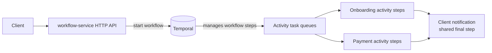

# Kotlin + Temporal + Micronaut request-flow showcase

This is a Kotlin multi-service Micronaut + Temporal project. `workflow-service` exposes the HTTP API and runs only workflow orchestration. Every activity runs in its own independently deployable Micronaut worker service.

| Flow | Shared steps | Unique step |
| --- | --- | --- |
| Onboarding | validate, welcome email, client update | provision customer |
| Payment | validate, receipt, client update | charge payment |

Every activity receives `RequestContext`; `RequestLogger` adds `requestId=...` to every log line. The final client-update activity is deliberately executed for both success and failure paths (it is a log-only mock client).

## Architecture flow



Temporal persists and coordinates the flow, then routes every activity to its dedicated task queue. Both flows finish with the shared client-notification activity.

## Repository layout

```text
infrastructure/
  temporal/                       Local Temporal server and UI Compose setup
services/
  workflow-service/               HTTP API + onboarding/payment workflow worker
  validation-service/             Validation activity worker
  customer-provisioning-service/  Customer provisioning activity worker
  welcome-email-service/          Welcome-email activity worker
  payment-charging-service/       Payment-charging activity worker
  receipt-service/                Receipt activity worker
  client-update-service/          Final client-update activity worker
shared/
  activity-common-lib/            Shared request types, workflow result, and activity metadata
  validation-lib/                 Validation Temporal activity contract
  customer-provisioning-lib/      Customer-provisioning Temporal activity contract
  welcome-email-lib/              Welcome-email Temporal activity contract
  payment-charging-lib/           Payment-charging Temporal activity contract
  receipt-lib/                    Receipt Temporal activity contract
  client-update-lib/              Client-update Temporal activity contract
  activity-utils/                 Activity worker lifecycle and request-logging helpers
```

## Run

Local builds require JDK 21. The included Docker build uses Eclipse Temurin 21. The project setup configures Homebrew's JDK 21 in `~/.zshrc`; open a new terminal (or run `source ~/.zshrc`) and confirm it:

```bash
java -version
```

The `make` targets also enforce that same JDK, including when launched from a terminal that was already open before the setup.

Build and start the entire system: Temporal, its UI at <http://localhost:8081>, Loki, Grafana at <http://localhost:3000>, the workflow API, and all activity services:

```bash
make infra-up
```

Useful infrastructure shortcuts:

```bash
make infra-status  # Show containers
make infra-logs    # Follow logs
make infra-down    # Stop containers
make infra-kill    # Force-stop and remove containers
```

The API is available at <http://localhost:8080> once all containers are healthy. For local development, start only Temporal and its UI, build the reactor once, then run each service in a separate terminal:

```bash
make infra-offline-up
./mvnw -U clean install -DskipTests

# Run each command in its own terminal.
make run-workflow
make run-validation
make run-customer-provisioning
make run-welcome-email
make run-payment-charging
make run-receipt
make run-client-update
```

Then start a flow:

```bash
curl -X POST localhost:8080/requests/onboarding -H 'Content-Type: application/json' \
  -d '{"requestId":"onboard-101","customerEmail":"ada@example.com"}'

curl -X POST localhost:8080/requests/payments -H 'Content-Type: application/json' \
  -d '{"requestId":"retry-payment-101","customerId":"cust-9","amountCents":1250}'
```

## Air-gapped / on-prem installation

Create the bundle on a connected machine that has the same CPU architecture as the target (or set `IMAGE_PLATFORM`, for example `linux/amd64`). It contains the complete Maven local repository and Maven Wrapper distribution, plus the Temporal, PostgreSQL, Temporal UI, Loki, and Grafana images. It does not build Java modules or service images.

```bash
make offline-bundle
# Or, for a typical x86_64 Linux target:
IMAGE_PLATFORM=linux/amd64 make offline-bundle
```

On Windows, run the equivalent PowerShell script:

```powershell
.\scripts\prepare-offline-bundle.ps1
# For an x86_64 Linux target:
.\scripts\prepare-offline-bundle.ps1 -ImagePlatform linux/amd64
```

Copy the source repository and the generated `offline-bundle/` directory to the on-prem host. The host needs Docker Compose, JDK 21, and no internet access. Load the images and Maven cache:

```bash
docker load --input offline-bundle/images.tar
make offline-install-maven-cache
```

On Windows, use:

```powershell
docker load --input offline-bundle\images.tar
.\scripts\install-offline-maven-cache.ps1
```

Start the infrastructure without pulling images:

```bash
make infra-offline-up
```

For local service development on the disconnected host, Maven will use the installed cache:

```bash
./mvnw --offline clean install -DskipTests
make run-validation
```

For the full Docker-based stack, build the service images on a connected machine, or add them to a separate release-image archive. Recreate this bundle whenever Maven dependencies or infrastructure image versions change.

Use a `requestId` beginning with `retry-` to see one transient validation retry. Use one beginning with `critical-` to produce a non-retryable business failure; the client still gets its final `FAILED` update. These prefixes exist only to make the behavior easy to demonstrate.

## Centralized logs

Open Grafana at <http://localhost:3000>, choose **Explore**, and select the preconfigured **Loki** source. Start with:

```logql
{service="payment-charging-service"}
```

To find every activity log for one request, query its structured metadata:

```logql
{service=~".+"} | requestId = "retry-payment-101"
```

`SERVICE_NAME` is a low-cardinality Loki label, while `requestId` is structured metadata. This keeps Loki indexes small while still making an individual request searchable.

## Send test requests

With `workflow-service` running on port 8080:

```bash
make run-workflow  # Run this in a separate terminal
make mock-onboarding
make mock-payment
make mock-retry
make mock-critical
```

Override the defaults when needed:

```bash
make mock-payment REQUEST_ID=payment-42 CUSTOMER_ID=customer-42 AMOUNT_CENTS=5000
```

## Design notes

- Every activity service listens only to its own Temporal task queue. This prevents, for example, the email worker from receiving payment activity tasks.
- `WorkflowSettings` applies exponential retry (three attempts) and explicitly lists `CriticalBusinessException` as non-retryable. Activities also create this error as Temporal's non-retryable `ApplicationFailure`, which prevents retry at the source.
- Workflow code is deterministic orchestration only. Logging and the mock client call happen inside activity services.
